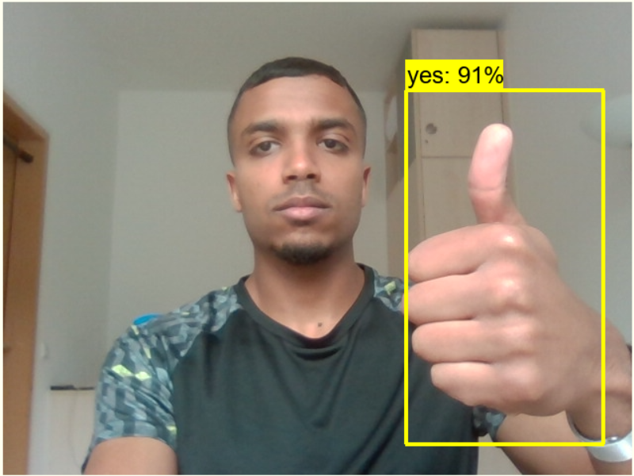

# Real Time Gesture Detection
## A deep learning sign language detection model that levreges the concept of Transfer Learning.
This project is trained on top of a pre-trained MobileNet model(used to classify 98 different objects) to generate a new model that detects sign languages(5 signs). Transfer learning is advantageous as it
addresses the known challanges while training a CNN model which require(longer training time, a large dataset and exceptionally advanced computing power). The project utilizes only 80 images for the additional training and only takes 30 minutes to train.
The project does the following:
* Collects training and testing images.
* Label the images and split them in to training and testing sets.
* Creates a label map.
* Generates Tensorflow Records.
* Modifies the MobileNet model(Transfer learning).
* Train the Model.
* Detect in real time.
     
      
## Installation
1. Clone this project
2. Follow the instructions here to install the Tensorflow Object Detection API and the pre-trained model - https://tensorflow-object-detection-api-tutorial.readthedocs.io/en/latest/install.html
3. Clone the labelImg repository - https://github.com/heartexlabs/labelImg
4. Follow the instructions in the jupyter notebooks *Data collector.ipynb* to capture images and *Object Detector.ipynb* to train your model. 
 

 